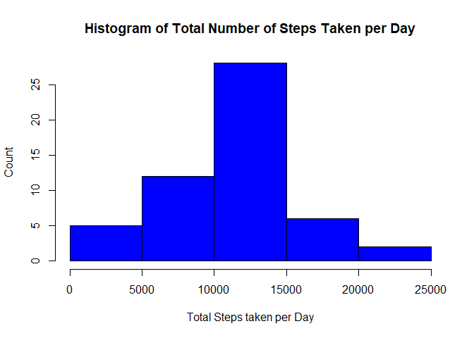
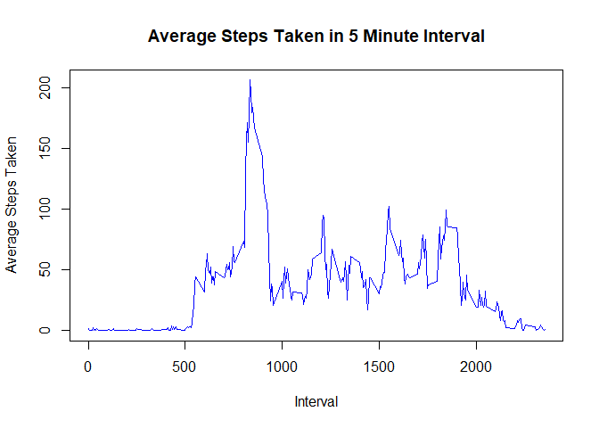
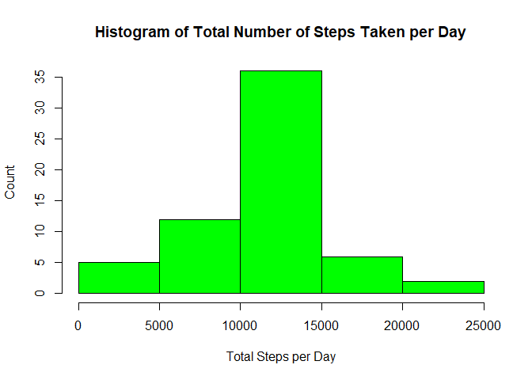
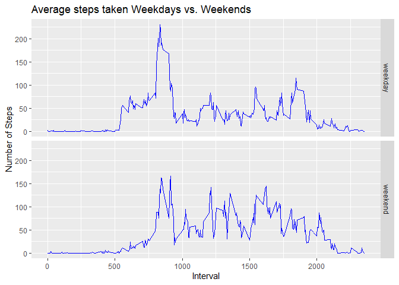

## Loading the library

```r
library(dplyr)
```

```
## 
## Attaching package: 'dplyr'
```

```
## The following objects are masked from 'package:stats':
## 
##     filter, lag
```

```
## The following objects are masked from 'package:base':
## 
##     intersect, setdiff, setequal, union
```

```r
library(ggplot2)
```

## Loading and preprocessing the data

```r
myfile <- unzip("activity.zip")
orgdata <- read.csv(myfile, header = TRUE, sep = ",", stringsAsFactors = FALSE)
```

## What is mean total number of steps taken per day?
1.Calculate the total number of steps taken per day

```r
mydata <- na.omit(orgdata)
stepsByday <- aggregate(mydata$steps, by = list(as.Date(mydata$date)), sum, na.rm=TRUE)
colnames(stepsByday) <- c("date", "steps")
```

2.Make a histogram of the total number of steps taken each day

```r
hist(stepsByday$steps, xlab = "Total Steps taken per Day", ylab = "Count", 
     main = "Histogram of Total Number of Steps Taken per Day", col = "blue")
```

<!-- -->

3.Calculate and report the mean and median of the total number of steps taken per day

```r
meanSteps <- mean(stepsByday$steps)
medianSteps <- median(stepsByday$steps)
```
The mean of the total number of steps taken per day is 1.0766189\times 10^{4}, the median of the total number of steps taken per day is 10765. 

## What is the average daily activity pattern?
1.Make a time series plot of the 5-minute interval (x-axis) and the average number of steps taken, averaged across all days (y-axis)

```r
stepsByIntrvl <- aggregate(mydata$steps, by = list(mydata$interval), mean)
colnames(stepsByIntrvl) <- c("interval", "meanSteps")
plot(stepsByIntrvl$interval, stepsByIntrvl$meanSteps, 
     xlab = "Interval", ylab = "Average Steps Taken", 
     main = "Average Steps Taken in 5 Minute Interval",
     type = "l", col = "blue")
```

<!-- -->

2.Which 5-minute interval, on average across all the days in the dataset, contains the maximum number of steps?

```r
maxInterval <- stepsByIntrvl[which.max(stepsByIntrvl$meanSteps),]$interval
```
The 5-minute interval of the maximun number of the average steps taken is 835.

## Imputing missing values
1.Calculate and report the total number of missing values in the dataset (i.e. the total number of rows with NAs)

```r
numMissing <- sum(is.na(orgdata))
```
The total number of missing values in the dataset is 2304.

2.Filling in all of the missing values in the dataset the mean for that 5-minute interval.

```r
mydata1 <- merge(orgdata, stepsByIntrvl, by="interval")
mydata1[is.na(mydata1$steps),]$steps <-mydata1[is.na(mydata1$steps),]$meanSteps
```

3.Create a new dataset that is equal to the original dataset but with the missing data filled in.

```r
newData <- select(mydata1, c("steps", "date", "interval"))
```

4.Make a histogram of the total number of steps taken each day and Calculate and report the mean and median total number of steps taken per day. Do these values differ from the estimates from the first part of the assignment? What is the impact of imputing missing data on the estimates of the total daily number of steps?

```r
newstepsByday <- aggregate(newData$steps, by = list(as.Date(newData$date)), sum)
colnames(newstepsByday) <- c("date", "steps")
hist(newstepsByday$steps, xlab = "Total Steps per Day", ylab = "Count", 
     main = "Histogram of Total Number of Steps Taken per Day", col="green")
```

<!-- -->

```r
newmeanSteps <- mean(newstepsByday$steps)
newmedianSteps <- median(newstepsByday$steps)
```
The mean of the total number of steps taken per day is 1.0766189\times 10^{4}, the median of the total number of steps taken per day is 1.0766189\times 10^{4}. The mean is unchanged, but the median moved slightly and is now equal to the mean.  , The mean is the same while changing the median based on replacing missing data with the mean for the 5-minute interval. 

## Are there differences in activity patterns between weekdays and weekends?
1.Create a new factor variable in the dataset with two levels – “weekday” and “weekend” indicating whether a given date is a weekday or weekend day.

```r
newData$day <- weekdays(as.Date(newData$date))
newData$daytype <- "weekday"
# Set saturday or sunday to be weekends
newData$daytype[newData$day %in% c("Saturday", "Sunday")] <- "weekend"
```

2.Make a panel plot containing a time series plot (i.e. type = "l") of the 5-minute interval (x-axis) and the average number of steps taken, averaged across all weekday days or weekend days (y-axis). See the README file in the GitHub repository to see an example of what this plot should look like using simulated data.

```r
meanWeek <- newData %>%
        group_by(daytype, interval) %>%
        summarize(meanSteps = mean(steps))

qplot(interval, meanSteps, data=meanWeek,
      geom="line",
      xlab="Interval",
      ylab="Number of Steps",
      main="Average steps taken Weekdays vs. Weekends",
      colour = I("blue"),
      facets =daytype ~ .)
```

<!-- -->

  There are earlier activities on weekdays. I think most people go to work on weekdays.
